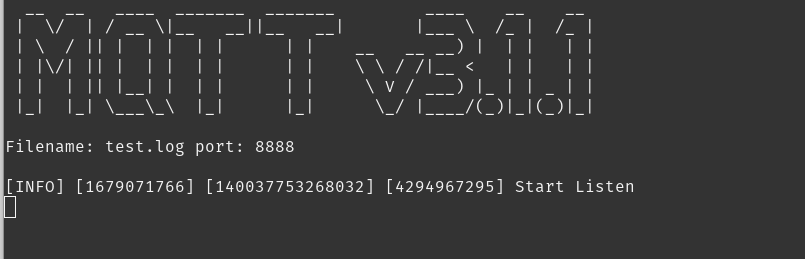

# MQTT v3.1.1
In this project, I wrote an MQTT server (version 3.1.1). I found this protocol interesting. I tried to write a server based on the documentation as much as possible, but I could make mistakes or miss some details. The project was tested with __mosquitto__

### Supported Technologies:
- __QoS__ (all levels)
- Reconnect to session (clean session)
- Sending __WillMessage__ on client connection to __WilTopic__ subscribers
- All __main commands__
### What is not yet
- __SSL/TSL connections__
- __Authentication__
### Peculiarities:
- For this project, I specifically wrote a prefix tree class
- I changed the PINGREQ timeout (increased by 2 times, instead of 1.5)
- When reconnecting to the session, all packets that remain are sent to the user.
-  The project is written using __Boost.Asio__ and __C++20__, so make sure your computer has it.
### Build the program

    cmake ..
    cmake --build .

### Server initialization

    ./mqtt_server -f filename -p port
___Note__: it is not necessary to initialize both parameters, the default parameters are set inside the program (filename - file.log, port - 1883)_

### Other
- Testing program: https://mosquitto.org/ 
- Documentation:  http://docs.oasis-open.org/mqtt/mqtt/v3.1.1/os/mqtt-v3.1/1-os.html

